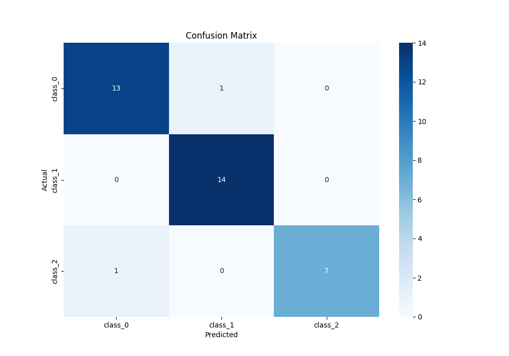
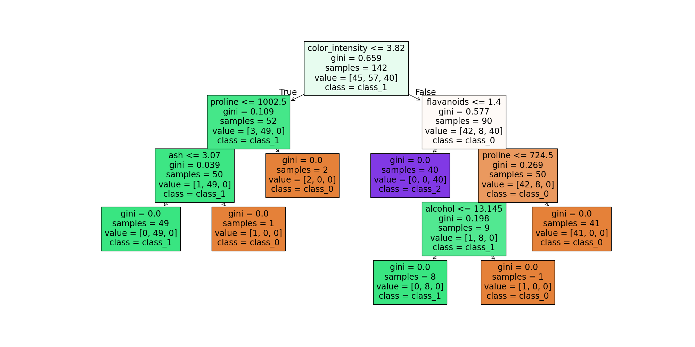

# Decision Tree Classifier MLOps Project

This project provides a full proof-of-concept (POC) for a Decision Tree classification model, including training, evaluation, and serving with a FastAPI endpoint. The entire process is tracked using MLflow, making it a suitable project for an MLOps portfolio.

## Table of Contents
- [Decision Tree Algorithm](#decision-tree-algorithm)
  - [Basic Concepts](#basic-concepts)
  - [Real-Life Use Cases](#real-life-use-cases)
  - [Mathematical Formulation](#mathematical-formulation)
- [Project Structure](#project-structure)
- [Installation Guide](#installation-guide)
- [Training and Evaluation](#training-and-evaluation)
  - [Dataset](#dataset)
  - [Training Process](#training-process)
  - [MLflow Tracking](#mlflow-tracking)
- [Model Serving](#model-serving)
- [Results](#results)
  - [Confusion Matrix](#confusion-matrix)
  - [Decision Tree Visualization](#decision-tree-visualization)

## Decision Tree Algorithm

### Basic Concepts

A Decision Tree is a non-parametric supervised learning method used for both classification and regression tasks. The goal is to create a model that predicts the value of a target variable by learning simple decision rules inferred from the data features. The tree is composed of:

- **Nodes**: Represent a test on a feature.
- **Edges/Branches**: Represent the outcome of the test.
- **Leaf Nodes**: Represent a class label (in classification) or a continuous value (in regression).

The tree is built by recursively splitting the dataset into smaller subsets based on the feature that provides the most information gain at each step.

### Real-Life Use Cases

- **Customer Churn Prediction**: Predicting which customers are most likely to leave a service.
- **Medical Diagnosis**: Assisting doctors in diagnosing diseases based on patient symptoms.
- **Credit Scoring**: Assessing the risk of lending money to a potential borrower.
- **Spam Detection**: Classifying emails as spam or not spam.

### Mathematical Formulation

Decision trees use a metric to measure the quality of a split. For a classification problem, the two most common metrics are **Gini Impurity** and **Information Gain (using Entropy)**.

#### Gini Impurity

The Gini impurity is a measure of how often a randomly chosen element from the set would be incorrectly labeled if it was randomly labeled according to the distribution of labels in the subset. The Gini impurity for a set of items with $J$ classes is:

$$
I_G(p) = \sum_{i=1}^{J} p_i (1 - p_i) = 1 - \sum_{i=1}^{J} p_i^2
$$

where $p_i$ is the fraction of items labeled with class $i$ in the set.

#### Information Gain

Information Gain is based on the concept of **Entropy**, which is a measure of uncertainty or randomness in a set. The entropy of a set with $J$ classes is:

$$
H(S) = - \sum_{i=1}^{J} p_i \log_2(p_i)
$$

The information gain is the difference between the entropy of the parent node and the weighted average of the entropies of the child nodes.

$$
IG(S, A) = H(S) - \sum_{v \in Values(A)} \frac{|S_v|}{|S|} H(S_v)
$$

The algorithm chooses the feature that provides the highest information gain (or the lowest Gini impurity) to split the data at each node.

## Project Structure

```
.
├── LICENSE
├── README.md
├── requirements.txt
├── serve_fastapi.py
├── train.py
├── models/
│   └── ... (trained models will be saved here)
└── utils/
    └── io_utils.py
```

## Installation Guide

1.  **Clone the repository:**
    ```bash
    git clone <your-repo-url>
    cd <your-repo-name>
    ```

2.  **Create a virtual environment and activate it:**
    ```bash
    python -m venv venv
    source venv/bin/activate  # On Windows, use `venv\Scripts\activate`
    ```

3.  **Install the dependencies:**
    ```bash
    pip install -r requirements.txt
    ```

## Training and Evaluation

### Dataset

This project uses the **Wine dataset**, which is a classic dataset from `sklearn.datasets`. It has 178 samples, 13 features, and 3 classes of wine. The `train.py` script automatically loads this dataset and saves it as `wine_dataset.csv`.

### Training Process

To train the model, run the `train.py` script:

```bash
python train.py
```

This script will:
1.  Load the Wine dataset.
2.  Split the data into training and testing sets.
3.  Train a `DecisionTreeClassifier`.
4.  Log parameters, metrics, and artifacts to MLflow.
5.  Save the trained model to the `models/` directory.

### MLflow Tracking

This project uses MLflow to track experiments. To start the MLflow UI, run:

```bash
mlflow ui
```

The UI will be available at `http://localhost:5000`. You can view the logged parameters, metrics, and artifacts for each run.

## Model Serving

To serve the trained model with FastAPI, run:

```bash
uvicorn serve_fastapi:app --reload
```

The API will be available at `http://localhost:8000`. You can interact with the API documentation at `http://localhost:8000/docs`.

### Endpoints

- **`GET /health`**: Health check endpoint.
- **`GET /model`**: Returns the name of the loaded model.
- **`POST /predict`**: Makes a prediction on a new data sample.

**Example `POST /predict` request:**

```json
{
  "features": [14.23, 1.71, 2.43, 15.6, 127, 2.8, 3.06, 0.28, 2.29, 5.64, 1.04, 3.92, 1065]
}
```

## Results

The following plots are generated during the training process and logged to MLflow.

### Confusion Matrix

The confusion matrix shows the performance of the classification model on the test set.



### Decision Tree Visualization

This is a visualization of the trained decision tree.

